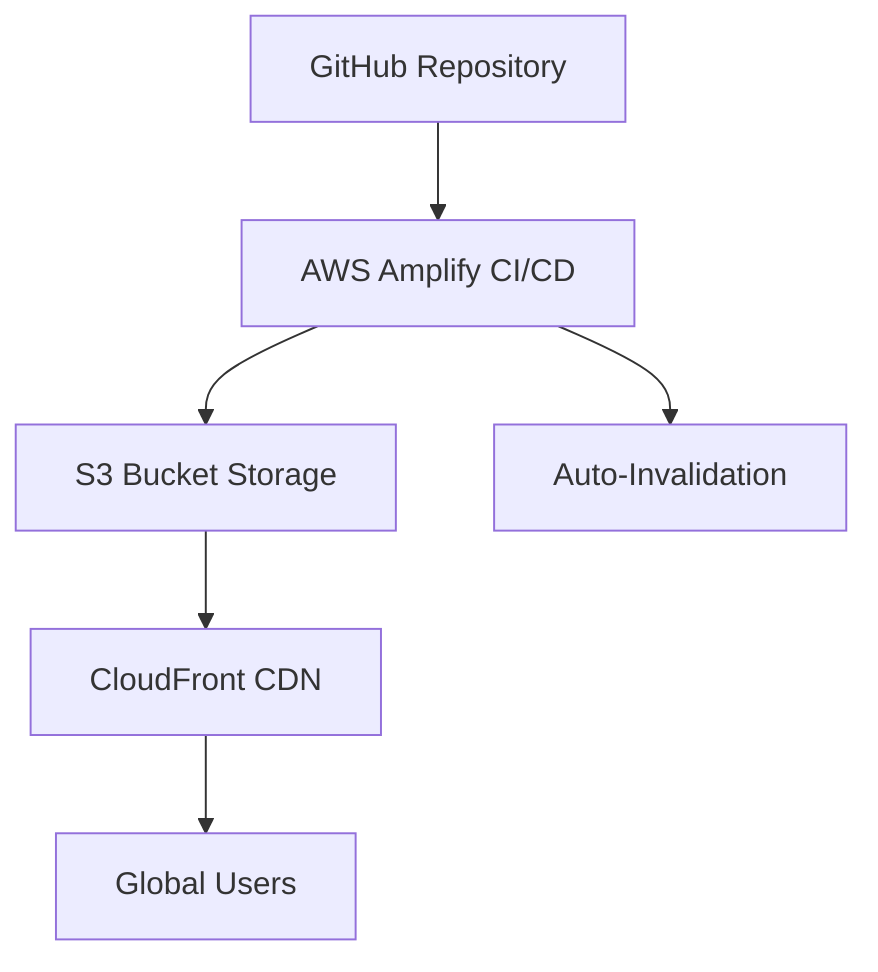

# DocuPicks - Curated Documentary Discovery

[](https://reactjs.org/)
[](https://www.typescriptlang.org/)
[](https://mui.com/)
[](https://aws.amazon.com)

**A focused React/TypeScript documentary discovery platform** curating essential documentaries about racial justice, police reform, and African American history in America. Powered by TMDB and OMDB APIs with intelligent content validation.


## Tech Stack Highlights

- **React 18** with TypeScript type safety
- **Material-UI** modern component library
- **Dual API integration** (TMDB + OMDB)
- **AWS Hosting** (S3 + CloudFront CDN)
- **Vite** build system for rapid development
- **Responsive grid layouts** (1-4 columns)

## Curated Focus Areas

- 🚨 Police brutality and reform  
- ✊🏿 Black Lives Matter movement  
- ⛓️ Historical slavery and its legacy  
- 🗳️ Voting rights and suppression  
- 📚 Systemic racism in America  

## Key Features

- 🎬 Curated selection of documentaries with IMDB ratings ≥6.0  
- 🔍 Dual API integration (TMDB + OMDB) for accurate data  
- 🛠️ Advanced content validation:  
  - Genre verification  
  - Documentary text analysis  
- 📺 Streaming provider information (US region)  
- 🌗 Light/Dark theme toggle  
- 🛡️ Fallback to hand-picked classics when API fails  
- ⚡ Intelligent batching and rate limiting  

## AWS Hosting Architecture



## Data Sources

- **TMDB API** - Primary movie discovery and streaming providers
- **OMDB API** - Detailed metadata validation
- **The Movie Database** - Provider logos

## Installation

1. Clone the repository:
```bash
git clone https://github.com/shaundawson/docupicks-react.git
cd docupicks-react
```

2. Install dependencies
```bash
npm install
```

3. Configure environment variables:
```bash
VITE_TMDB_API_KEY=your_tmdb_key
VITE_OMDB_API_KEY=your_omdb_key
```

4. Start development server
```bash
npm run dev
```